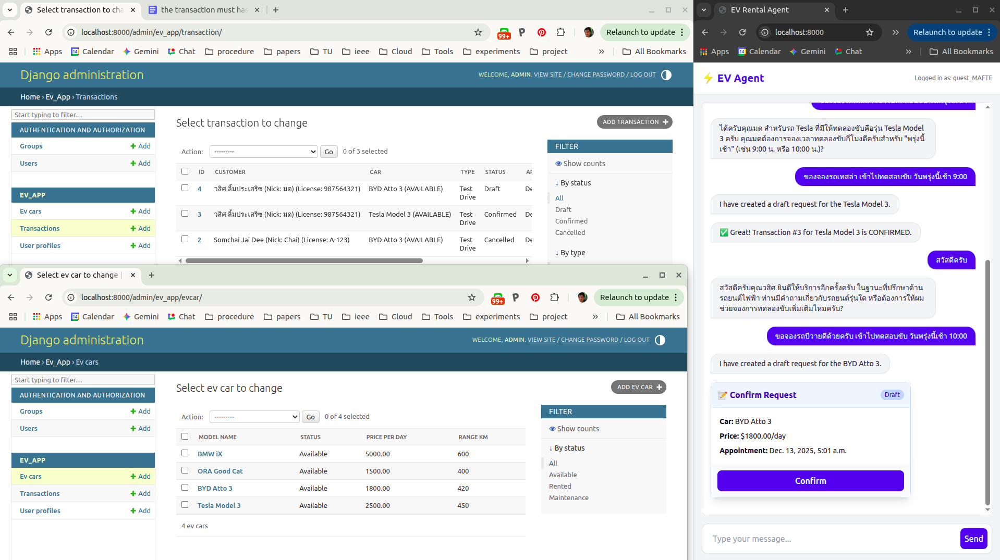

# Project Documentation: EV Rental Agent MVP

**Version:** 1.4
**Date:** October 26, 2023
**Author:** Wasit Limprasert

## 1. Executive Summary

The **EV Rental Agent MVP** is an AI-driven web application designed to streamline the vehicle rental process. Unlike traditional menu-driven interfaces, this system employs a **Large Language Model (LLM)** agent powered by **DSPy** to handle complex user intents—from customer onboarding and inventory discovery to transaction management—through natural language.

The system utilizes a **Hybrid UI** architecture, combining the flexibility of conversational AI with the safety and clarity of structured graphical widgets for critical actions like booking confirmations.

## 2. System Architecture

The application is architected as a containerized Django monolith, ensuring rapid development and deployment consistency while maintaining strict separation of concerns between business logic and AI reasoning.

### 2.1 High-Level Design
The system follows a **Server-Side Rendered (SSR)** pattern to minimize client-side complexity while delivering dynamic AI interactions.

1.  **Client Layer:** Standard Web Browser. Interactions are handled via HTML Forms and HTTP POST requests.
2.  **Application Layer:** Django 5.x Web Server.
    * **View Controller:** Manages session state and renders templates.
    * **AI Service:** A specialized DSPy module that interfaces with the Google Gemini API.
3.  **Data Layer:** PostgreSQL 16 database for ACID-compliant storage of user profiles, vehicle inventory, and transaction records.

### 2.2 The "Hybrid AI" Workflow
1.  **Input:** User submits a natural language query (e.g., "Book a Tesla").
2.  **Reasoning:** The DSPy Agent analyzes the request, utilizing a **ReAct (Reasoning + Acting)** loop to query the database via defined Tools.
3.  **Action:** If a transaction is required, the Agent generates a **Draft Record** in the database.
4.  **Hybrid Rendering:** The Django View detects the draft creation and injects a structured **HTML Widget** (Booking Card) into the chat stream alongside the AI's text response.
5.  **Confirmation:** The user interacts with the widget (clicking "Confirm"), bypassing the AI to execute a direct, deterministic state change in the database.

## 3. Technology Stack

| Component | Technology | Description |
| :--- | :--- | :--- |
| **Backend Framework** | **Django 5.x** | Provides ORM, Authentication, and Session Management. |
| **Language** | **Python 3.11** | Core runtime environment. |
| **AI Framework** | **DSPy** | Orchestrates the LLM, managing prompts, signatures, and tool execution. |
| **LLM Provider** | **Google Gemini** | The underlying intelligence model (via API). |
| **Database** | **PostgreSQL 16** | Relational database for persistent storage. |
| **Frontend Styling** | **Tailwind CSS** | Utility-first CSS framework (served via local static files). |
| **Infrastructure** | **Docker Compose** | Container orchestration for reproducible environments. |

## 4. Data Model

The database schema is optimized to support the agent's tool usage.

### 4.1 Core Entities

* **`UserProfile`**
    * Links to the Django `User` model.
    * Stores KYC data: `full_name`, `nickname`, `license_id`, `phone`.
* **`EVCar`** (Inventory)
    * Represents the physical fleet.
    * Attributes: `model_name`, `range_km`, `price_per_day`, `status` (Available/Rented).
* **`Transaction`**
    * The central record for business operations.
    * **Types:** `TEST_DRIVE`, `PURCHASE`.
    * **Statuses:**
        * `DRAFT`: Created by AI, pending user approval.
        * `CONFIRMED`: Approved by user via UI widget.
        * `CANCELLED`: Voided by user or agent.
    * **Timestamps:** Explicit separation of `created_at` (record creation) and `appointment_date` (event scheduling).

## 5. Agent Specifications

The AI logic is encapsulated in the `ev_app.dspy_agent` module.

### 5.1 DSPy Signature
The agent is defined with the following signature:
* **Role:** Expert EV Consultant.
* **Inputs:** Conversation History, User Query, User Context ID.
* **Outputs:** Chain-of-thought Reasoning, Action (Tool Result).

### 5.2 Toolset
The Agent has access to four deterministic Python functions:
1.  **`onboard_user`**: Updates profile data. *Constraint: Must collect Name, Nickname, and License ID.*
2.  **`search_cars`**: Performs fuzzy search on the `EVCar` table.
3.  **`create_transaction_draft`**: Generates a `Transaction` record with `DRAFT` status and returns a JSON payload to trigger the UI widget.
4.  **`cancel_transaction`**: Updates transaction status to `CANCELLED`.

## 6. Installation & Deployment

The project utilizes a master installation script for automated setup.

### 6.1 Prerequisites
* Docker Desktop (or Engine) & Docker Compose.
* Google Gemini API Key.

### 6.2 Installation Steps
1.  **Execution:** Run `./install.sh` to scaffold the directory structure and generate source code.
2.  **Configuration:** Edit the generated `.env` file to insert the `GEMINI_API_KEY`.
3.  **Deployment:** Execute `docker-compose up --build`. The container's entrypoint script handles database migrations and initial data loading (`cars.csv`) automatically.

## 7. Testing Strategy

Quality Assurance is performed via a defined set of scenarios found in  [TEST_CASES.md](TEST_CASES.md "Test Scenarios") .

* **Category 1: Onboarding:** Verifies the agent's ability to detect missing fields and persist user profile data.
* **Category 2: Inventory:** Verifies RAG capabilities (Retrieval-Augmented Generation) against the CSV data.
* **Category 3: Transaction Flow:** Verifies the end-to-end "Draft -> Widget -> Confirmation" cycle.
* **Category 4: System Persistence:** Verifies data integrity across container restarts.

## 8. Setting Up
please check the following resources;
* [setup.md](setup.md "setting up")
* [TEST_CASES.md](TEST_CASES.md "Test Scenarios")